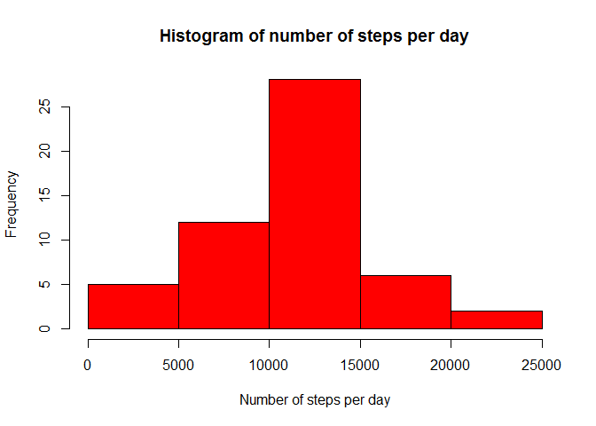
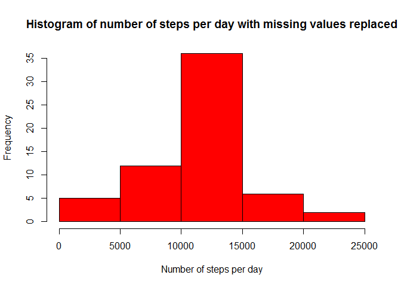
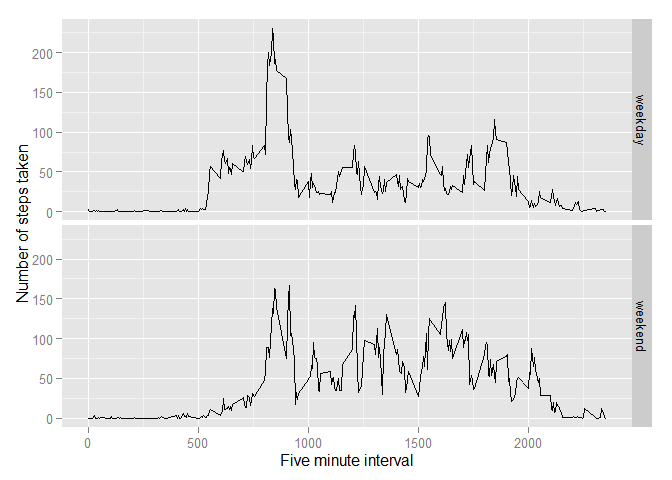

# Reproducible Research: Peer Assessment 1

## Loading and preprocessing the data
- **Load the data**

Unzipping and loading the data:

```r
setwd("~/R_workspace/ReproducibleResearch")
unzip(zipfile="activity.zip")
data <- read.csv("activity.csv")
```

## What is mean total number of steps taken per day?

- **Calculate the total number of steps taken per day**

```r
totalSteps <- aggregate(steps ~ date, data = data, sum, na.rm=TRUE)
```

- **Histogram of the total number of steps taken each day**

```r
hist(totalSteps$steps,ylab="Frequency",xlab="Number of steps per day", col = "red", main="Histogram of number of steps per day")
```

 

- **Mean and median of the total number of steps taken per day**

```r
mean(totalSteps$steps)
```

```
## [1] 10766.19
```

```r
median(totalSteps$steps)
```

```
## [1] 10765
```
The mean of the total steps is equal to *10766.19*.

The median of the total steps is equal to *10765*.

## What is the average daily activity pattern?
 
- **Time series plot of the 5-minute interval (x-axis) and the average number of steps taken, averaged across all days (y-axis)**

```r
stepsMeanInterval <- aggregate(steps~interval,data=data,mean,na.rm=TRUE)
plot(steps~interval,data=stepsMeanInterval,typ='l',col="red")
```

 

- **Which 5-minute interval, on average across all the days in the dataset, contains the maximum number of steps?**

```r
stepsMeanInterval[which.max(stepsMeanInterval$steps), ]
```

```
##     interval    steps
## 104      835 206.1698
```
Interval *835* has the maximum average steps equal to *206.2*.

## Imputing missing values

- **Calculate and report the total number of missing values in the dataset**

```r
sum(is.na(data$steps))
```

```
## [1] 2304
```
A total of *2304* rows contain no value for the amount of steps.

- **Devise a strategy for filling in all of the missing values in the dataset.**

Using the already created average steps per interval, we will replace a missing value with the average value of that specific interval. The implementation is shown in the next step.

- **Create a new dataset that is equal to the original dataset but with the missing data filled in.**

A new variable naRemovedData is created:

```r
naRemovedData <- data
for(i in 1:nrow(data)){
  if(is.na(data$steps[i])){
    naRemovedData$steps[i] <- subset(stepsMeanInterval,interval==data$interval[i])$steps
  }
}
```

- **Make a histogram of the total number of steps taken each day** 

```r
naRemovedTotalSteps<- aggregate(steps ~ date, data = naRemovedData, sum)
hist(naRemovedTotalSteps$steps,ylab="Frequency",xlab="Number of steps per day", col = "red", main="Histogram of number of steps per day with missing values replaced")
```

 

- **Mean and Median of the total number of steps taken per day**

```r
mean(naRemovedTotalSteps$steps)
```

```
## [1] 10766.19
```

```r
median(naRemovedTotalSteps$steps)
```

```
## [1] 10766.19
```
The mean of the total steps with missing values replaced is equal to *10766.19*.

The median of the total steps with missing values replaced is equal to *10766.19*.

*Do these values differ from the estimates from the first part of the assignment? What is the impact of imputing missing data on the estimates of the total daily number of steps?*

After imputing the missing values the average stayed the same, only the median changed.


## Are there differences in activity patterns between weekdays and weekends?
*Use the dataset with the filled-in missing values for this part.*

-**Create a new factor variable in the dataset with two levels - "weekday" and "weekend" indicating whether a given date is a weekday or weekend day.**

```r
naRemovedData$date <- as.Date(naRemovedData$date,"%Y-%m-%d")
naRemovedData$day <- weekdays(naRemovedData$date)
for(i in 1:nrow(naRemovedData)){
  if(naRemovedData$day[i] %in% c("Saturday","Sunday")){
    naRemovedData$day_type[i]="weekend"
  }else{
    naRemovedData$day_type[i]="weekday"
  }
}
```


-**Make a panel plot containing a time series plot (i.e. type = "l") of the 5-minute interval (x-axis) and the average number of steps taken, averaged across all weekday days or weekend days (y-axis).**

```r
naRemovedMeanInterval <- aggregate(steps~interval+day_type,data=naRemovedData,mean)
library(ggplot2)
```

```
## Warning: package 'ggplot2' was built under R version 3.2.1
```

```r
ggplot(naRemovedMeanInterval,aes(interval,steps))+geom_line()+facet_grid(day_type~.)+xlab("Five minute interval")+ylab("Number of steps taken")
```

 
